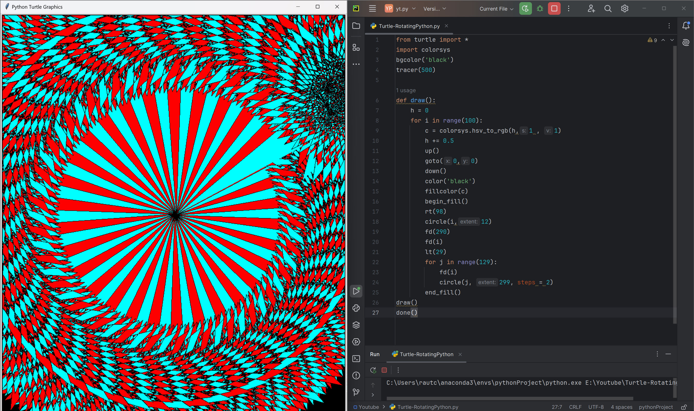

# Rainbow Vortex

appears to swirl and twirl like a vortex. The pattern is formed by drawing a series of connected circles with increasing radii, with each circle being drawn in a different color from the HSV color space. The colorsys module is used to convert HSV values to RGB colors, creating a smooth transition between colors.

# Tutorial is available on youtube channel 
click on the link to see :- ([Open in Youtube]())

# Screenshot

Rainbow-Spiral

# Features
Rainbow colors: The pattern features a vibrant, rainbow-colored palette that shifts smoothly from one color to the next.
Swirling motion: The circles are drawn with a right turn of 98 degrees, creating a sense of swirling motion and dynamic energy.
Increasing complexity: The pattern becomes increasingly complex as the circles get larger, creating a sense of depth and dimensionality.

# Run
To run this code, save it to a file with a .py extension (e.g., rainbow_vortex.py) and execute it using Python (e.g., python rainbow_vortex.py). This will launch a window displaying the Rainbow Vortex pattern.

# License
This code is licensed under the MIT License. Feel free to modify, distribute, and use it for any purpose.

# snake.coding
We create a project each 4 days with voting on our <a href="https://youtube.com/@snakecoding_12" target="_blank">Youtube</a> channel.
You can vote for upcoming projects on our channel **community** page :wink:

